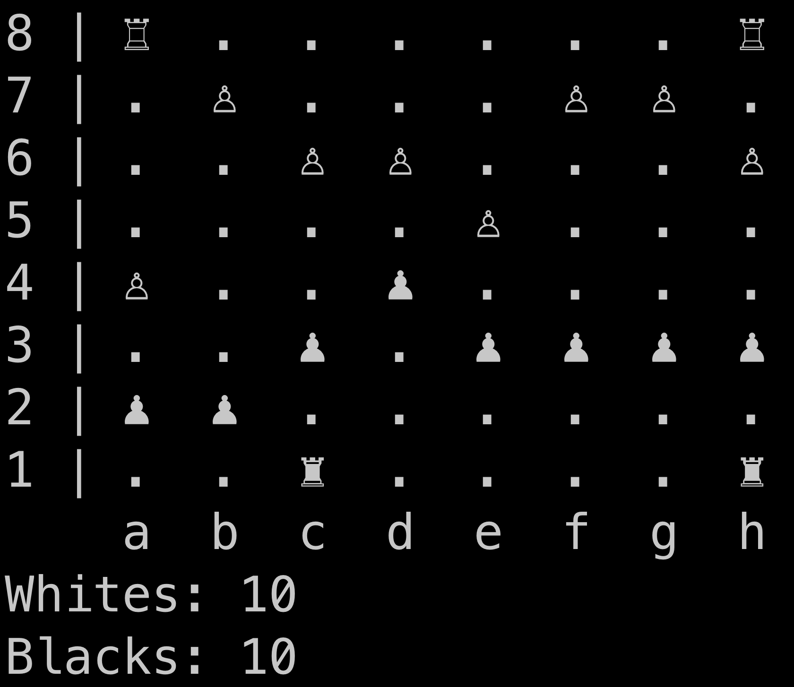

# ChessGame-on-Python
Гра шахи на Python.

# Що це за гра?
При запуску файлу main.py, який знаходиться у папці src, ви побачете шахове поле, де будуть ходити фігури. Виграє той, хто забере фігури суперника. Пішак та тура ходять як у звичайних шахах. У вийняту взяття на проході, яке у цій грі не реалізоване. Також є тільки пішакі та тури, але ви можете додати і ішні фігури.

# Демонстрація ПЗ
